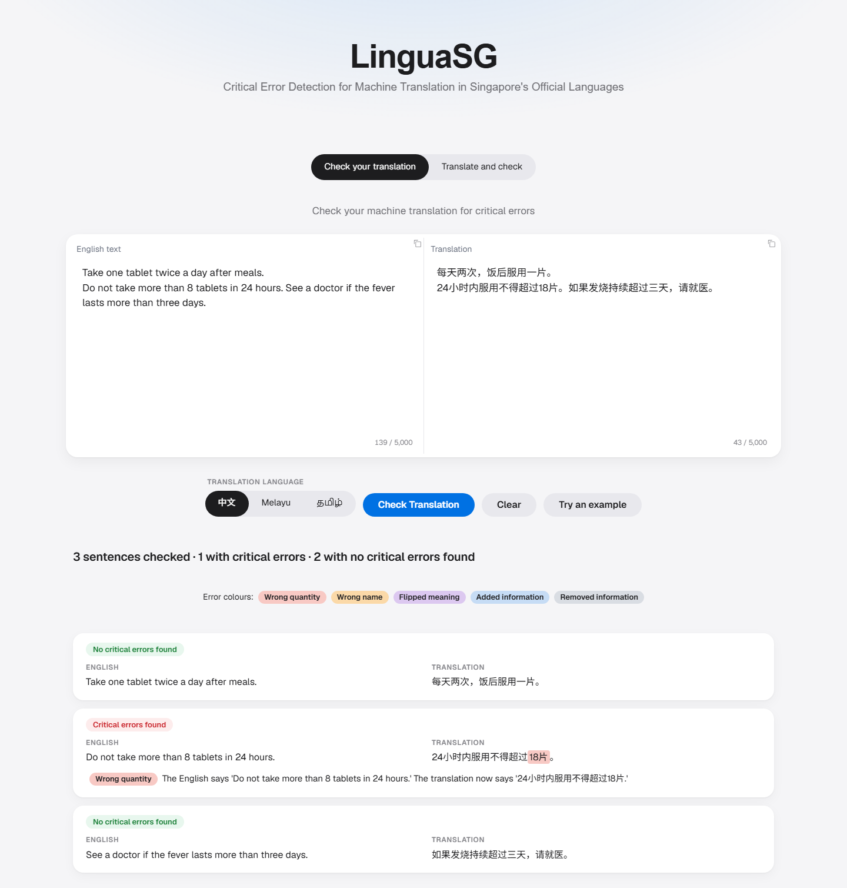
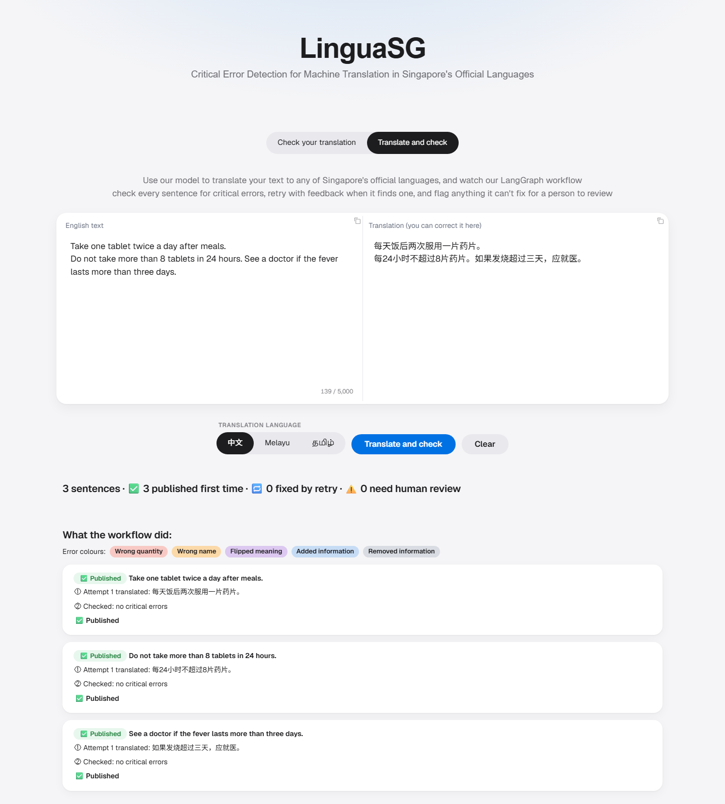
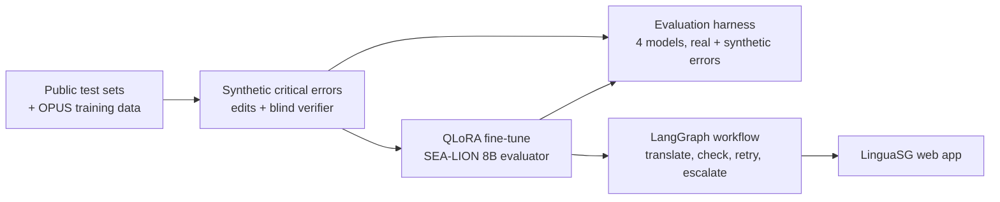
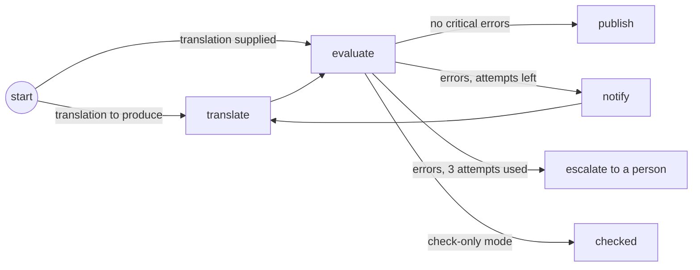

# LinguaSG: Critical Error Detection for Machine Translation in Singapore's Official Languages


Machine translation is fluent enough to publish, but a single wrong number or a dropped
"not" in a public notice can change what a reader does. LinguaSG finds these
**meaning-critical errors** in English → Chinese, Malay and Tamil translations, using a
fine-tuned open-weight evaluator and a LangGraph workflow that translates, checks,
retries with feedback, and escalates to a person when it can't fix an error.

## Results at a glance

| | Base SEA-LION 8B | Fine-tuned (QLoRA) |
|---|---|---|
| Planted critical errors caught (5,926 verified test examples) | 0.1% | **85.8%** at a **2.7%** false-alarm rate, right category 97.8% |
| Real human-labelled errors, Chinese (WMT21): recall / false alarms | 0.0% / 0.0% | 15.8% / 5.3% |
| Real human-labelled errors, Tamil (IndicMT): recall / precision | 0.0% / – | 8.6% / **81%** |

Fine-tuning turned a model that flagged almost nothing into a precise detector: it catches
86% of planted critical errors (93% in Malay) with few false alarms. On real machine
translation errors, which are messier than single planted edits, it stays precise but is
conservative, catching a minority; closing that gap is the main next step. Serving the
model in 8-bit (FP8) instead of 16-bit made no measurable difference (tested on AWS).

In the LangGraph workflow (898 test sentences), 97.1% of sentences were published on the
first attempt, 2.4% were fixed by retrying with the evaluator's feedback, and 0.4% were
escalated to a person.

## Screenshots

**Check your translation:** the fine-tuned evaluator catches a planted wrong dose (8 → 18 tablets)
in a Chinese translation and passes the correct sentences.



**Translate and check:** SEA-LION translates, the evaluator checks each sentence, and the
workflow shows what it did.



## Quickstart

```bash
git clone https://github.com/calvin4370/MT-Critical-Error-Detection-SG.git
cd MT-Critical-Error-Detection-SG
uv sync --group app
# The web app without any models (simulated checks), to see the interface
uv run --group app python -m safetranslate.app configs/workflow.yaml --preview
```

Open http://localhost:7860. Running the real models needs a GPU; see [Reproduce it](#reproduce-it).

## Why this matters

Singapore publishes public information in four official languages. A translation can
read perfectly and still be dangerous: "take 500 mg" becoming "take 500 g", "do not take
with alcohol" losing its "not", or a clinic's name swapped for another. Standard
translation scores mostly measure overlap with a reference, and barely move when the meaning
does: in this project's test set, a translation with one planted critical error still scores
a median chrF of 92.3 out of 100 against the correct translation, and 84% score 80 or higher. This project targets exactly those errors, in five
categories: **wrong quantity, wrong name, flipped meaning, added information and removed
information**.

## Intended use

- **For:** helping officers and translators catch meaning-critical errors before a
  translation is published, and showing *where* each error is.
- **Not for:** replacing professional translators or human review. The checker misses some
  errors (see the recall figures) and sometimes raises false alarms; sentences it can't
  resolve are escalated to a person by design.
- **Data handling:** in the local setup, text never leaves the machine (open-weight models
  served locally).

## How it works



## Data

| Role | Dataset | Chinese | Malay | Tamil |
|---|---|---|---|---|
| Training | OPUS wikimedia (cleaned) | 299,003 | 263,686 | 227,151 |
| Validation (tuning only) | FLORES+ dev | 997 | 997 | 997 |
| Test | FLORES+ devtest | 1,012 | 1,012 | 1,012 |
| Test | NTREX-128 | 1,997 | 1,997 | 1,997 |
| Test | WMT24++ | 960 | (none exists) | 960 |
| Test | TICO-19 (COVID-19 health content) | 3,071 | 3,071 | 3,071 |
| Real-error test | WMT21 Critical Error Detection | 1,000 (158 critical) | – | – |
| Real-error test | IndicMT Eval | – | – | 1,475 (643 critical) |

All downloads are pinned to a version. Cleaning of the training data, in order: citation
marks removed; Traditional → Simplified Chinese (about 31% of Chinese targets contained
Traditional characters; only text that actually contains Traditional characters is
converted, after sampling showed that converting everything rewrote correct mainland
vocabulary); identical and junk pairs dropped; length-ratio outliers dropped (bounds
from professional translations); and any pair overlapping the validation or test sets
removed to prevent contamination.

## Synthetic critical errors

Real labelled critical errors are scarce (none exist for Malay), so the training and test
data are made by planting one known error into a correct translation:

1. **An LLM proposes a find-and-replace edit; code applies it.** Asking the model to
   rewrite the whole translation failed: it returned the text unchanged 58% of the time
   while describing an error that wasn't there. Structured edits, a JSON schema that
   fixes the number of edits and the allowed categories, and retries with specific
   feedback raised the pass rate from 30% to 90%.
2. **Automatic checks:** the edit must change the text, stay small, and not touch
   protected spans.
3. **A blind verifier** (Gemma 3 12B, a different model family) sees only the original
   and altered translations, explains the difference, then decides whether the meaning
   changed; code compares its answer with the intended category. The first design,
   asking "is this claimed error correct?", agreed with 80 of 80 claims; the blind version
   agreed with a hand-labelled answer key on 15 of 18 and rejected all 5 weak examples.

| | Tasks | Passed automatic checks | Rejected by verifier | Final examples (altered + original) |
|---|---|---|---|---|
| Train | 14,995 | 13,437 (90%) | not verified (stated limitation) | 26,874 |
| Validation | 750 | 700 (93%) | 178 (25%) | 1,044 |
| Test | 4,500 | 4,157 (92%) | 1,194 (29%) | 5,926 |
| Total | 20,245 | 18,294 (90%) | | 33,844 |

## Finding: the base model can't judge

Before fine-tuning, I tried to fix the base SEA-LION judge with prompting. On 100 real
human-labelled translations and 100 synthetic examples, no prompt format made its flags
depend on whether an error was present: recall stayed roughly equal to the false-alarm
rate.

| Prompt format | WMT21 (zh) recall / false alarms | IndicMT (ta) | Synthetic |
|---|---|---|---|
| List the errors | 0% / 0% | 0% / 0% | 4% / 2% |
| Decide yes/no first | 89% / 85% | 92% / 76% | 100% / 92% |
| Decide first + calibration wording | 67% / 71% | 68% / 72% | 92% / 69% |

Its answer followed the output format rather than the translation: with the JSON format
enforced it returned no errors for "500 mg → 500 g"; in free text it found the error and
invented a second one. Lesson: always report recall next to the false-alarm rate, and
evaluate LLM judges on labelled data.

The same sensitivity hit the fine-tuned model: with the server enforcing the JSON schema
it flagged every real translation. The server's grammar writes `"errors": [` with a space
that the model, trained on compact JSON, had never seen; that one character derailed it.
Served without enforcement (replies are still validated), it judged 10/10 clean held-out
examples correctly and caught 9/10 planted errors. The fine-tuned model is therefore
served without enforcement; base models keep it, since without it they don't produce
JSON at all.

## Fine-tuning the evaluator

Next experiment (scripts ready, `scripts/aws/launch.sh train`): LoRA on the full 16-bit base
on a 24 GB cloud GPU, to measure what 4-bit QLoRA costs in accuracy.

- **Base model:** SEA-LION v3 8B (AI Singapore, trained for Southeast Asian languages).
- **Method:** QLoRA: the base is frozen in 4-bit (NF4), and only small LoRA adapters
  (rank 16, all linear layers) are trained, so an 8B model trains on a 12 GB consumer GPU.
- **Data:** 26,661 training examples (the 1% over 1,536 tokens were dropped rather than
  truncated, which would cut off the answer); each is the exact prompt the harness uses
  plus the correct JSON answer, with loss on the answer only. Half contain a planted error;
  half are the clean originals, teaching the model when *not* to flag.
- **Training:** 1 epoch, 1,667 steps of 16 examples, learning rate 2e-4 (cosine),
  checkpointed every 200 steps and resumable; tracked in MLflow.
- **Validation loss** (300 held-out examples): 0.170 (step 200) → 0.137 (400) → 0.116 (1,000)
  → 0.111 (1,600), still falling slowly at the end of the single epoch; 4.2 hours on an
  RTX 4070 Ti.

| Synthetic test (FP8 serving) | Recall (95% CI) | False alarms (95% CI) | Right category |
|---|---|---|---|
| All | 85.8% (84.5–87.1) | 2.7% (2.2–3.3) | 97.8% |
| Chinese | 82.0% (79.5–84.2) | 2.5% (1.7–3.7) | 96.9% |
| Malay | 92.7% (90.9–94.1) | 1.6% (1.0–2.5) | 98.6% |
| Tamil | 82.6% (80.0–84.9) | 4.1% (3.0–5.6) | 97.6% |

Hardest cases: removed information in Chinese (67% caught) and wrong names in Tamil (75%).
The base model caught 0.1%. At full 16-bit precision on an AWS GPU the results were the same
within the confidence intervals (85.8% vs 86.2% recall).

On the same 1,383 synthetic test items, the fine-tuned 8B model and Gemma 4 31B (about four
times larger, via API) compare as follows:

| Model | Recall | False alarms | Precision |
|---|---|---|---|
| SEA-LION 8B fine-tuned | 85.7% (82.8–88.1) | 2.8% (1.8–4.3) | 96.6% |
| Gemma 4 31B | 91.5% (89.1–93.4) | 16.3% (13.7–19.2) | 84.1% |
| SEA-LION 8B base | 0.0% | 0.3% | – |

So the fine-tuned model gives about six times fewer false alarms at slightly lower recall,
running locally on a 12 GB GPU. On real errors (see Model comparison) the fine-tuned 8B
model has the lowest recall but among the fewest false alarms; Gemma 4 31B, about four
times larger, catches about 65% but also flags 38% of correct Chinese translations.

## Model comparison

Every model is compared on the same sentences.

**Translation quality** (higher is better; COMET-22 matches human judgements best):

| Language | Model | Sentences | spBLEU | chrF | COMET-22 |
|---|---|---|---|---|---|
| zh | SEA-LION 8B | 991 | 29.0 | 34.7 | 0.853 |
| zh | Qwen3 8B | 991 | 34.7 | 38.7 | 0.866 |
| zh | Gemma 3 12B | 991 | 33.3 | 37.2 | 0.857 |
| zh | Gemma 4 31B | 991 | 37.6 | 41.2 | 0.873 |
| ms | SEA-LION 8B | 996 | 39.4 | 65.2 | 0.882 |
| ms | Qwen3 8B | 996 | 33.1 | 61.0 | 0.864 |
| ms | Gemma 3 12B | 996 | 42.1 | 66.3 | 0.872 |
| ms | Gemma 4 31B | 996 | 47.2 | 70.9 | 0.894 |
| ta | SEA-LION 8B | 941 | 21.2 | 48.3 | 0.845 |
| ta | Qwen3 8B | 941 | 10.5 | 38.5 | 0.737 |
| ta | Gemma 3 12B | 941 | 25.9 | 51.7 | 0.854 |
| ta | Gemma 4 31B | 941 | 27.8 | 53.4 | 0.870 |

**Detecting real critical errors** (human-labelled; recall = errors caught, false-positive
rate = correct translations wrongly flagged):

| Dataset | Model | Items | Recall (95% CI) | False-positive rate (95% CI) | Precision |
|---|---|---|---|---|---|
| wmt21_ced | SEA-LION 8B | 499 | 0.0% (0.0%-5.3%) | 0.0% (0.0%-0.9%) | - |
| wmt21_ced | SEA-LION 8B fine-tuned | 499 | 13.0% (7.0%-23.0%) | 6.3% (4.4%-9.0%) | 25.0% |
| wmt21_ced | Qwen3 8B | 499 | 60.9% (49.1%-71.5%) | 42.6% (38.0%-47.3%) | 18.7% |
| wmt21_ced | Gemma 3 12B | 499 | 21.7% (13.6%-32.8%) | 7.4% (5.3%-10.3%) | 31.9% |
| wmt21_ced | Gemma 4 31B | 499 | 66.7% (54.9%-76.6%) | 37.9% (33.4%-42.6%) | 22.0% |
| indicmt | SEA-LION 8B | 478 | 0.0% (0.0%-1.8%) | 0.0% (0.0%-1.4%) | - |
| indicmt | SEA-LION 8B fine-tuned | 478 | 8.7% (5.6%-13.3%) | 1.5% (0.6%-3.7%) | 81.8% |
| indicmt | Qwen3 8B | 478 | 19.8% (14.9%-25.8%) | 8.5% (5.7%-12.4%) | 64.1% |
| indicmt | Gemma 3 12B | 478 | 17.9% (13.3%-23.7%) | 2.2% (1.0%-4.7%) | 86.0% |
| indicmt | Gemma 4 31B | 478 | 64.7% (58.0%-70.9%) | 11.8% (8.5%-16.2%) | 80.7% |

**Critical errors in each model's translations**, as flagged by the fine-tuned evaluator.
The "corrected" column adjusts for the judge's accuracy measured on synthetic errors; since
it catches far fewer real errors than synthetic ones, treat the corrections as unreliable
and the flagged rates as a relative comparison (e.g. Qwen's Tamil stands out).

| Language | Model | Sentences | Flagged by the judge (95% CI) | Corrected for the judge's accuracy |
|---|---|---|---|---|
| zh | SEA-LION 8B | 499 | 3.6% (2.3%-5.6%) | 1.4% |
| zh | Qwen3 8B | 499 | 2.0% (1.1%-3.6%) | 0.0% |
| zh | Gemma 3 12B | 499 | 2.6% (1.5%-4.4%) | 0.1% |
| zh | Gemma 4 31B | 499 | 1.6% (0.8%-3.1%) | 0.0% |
| ms | SEA-LION 8B | 919 | 2.3% (1.5%-3.5%) | 0.8% |
| ms | Qwen3 8B | 919 | 4.2% (3.1%-5.7%) | 2.9% |
| ms | Gemma 3 12B | 919 | 3.9% (2.8%-5.4%) | 2.6% |
| ms | Gemma 4 31B | 919 | 0.9% (0.4%-1.7%) | 0.0% |
| ta | SEA-LION 8B | 829 | 3.7% (2.6%-5.3%) | 0.0% |
| ta | Qwen3 8B | 829 | 19.1% (16.5%-21.9%) | 19.0% |
| ta | Gemma 3 12B | 829 | 2.9% (2.0%-4.3%) | 0.0% |
| ta | Gemma 4 31B | 829 | 1.4% (0.8%-2.5%) | 0.0% |

## LangGraph workflow



Each sentence runs through the graph in parallel; retries pass the previous attempt's
errors back to the translator as feedback. The same graph serves both app tabs: a
conditional entry skips translation when the user supplies their own. Results were
measured by an independent checker from a different model family:

| Group | Sentences | Published first time | Fixed by retry | Escalated | Mean attempts | Errors, single pass | Errors reaching readers |
|---|---|---|---|---|---|---|---|
| all | 898 | 97.1% (95.8%-98.0%) | 2.4% (1.6%-3.7%) | 0.4% (0.2%-1.1%) | 1.04 | 5.3% (4.1%-7.0%) | 5.0% (3.8%-6.6%) |
| zh | 300 | 98.0% (95.7%-99.1%) | 1.7% (0.7%-3.8%) | 0.3% (0.1%-1.9%) | 1.02 | 4.3% (2.5%-7.3%) | 4.7% (2.8%-7.7%) |
| ms | 300 | 97.3% (94.8%-98.6%) | 2.0% (0.9%-4.3%) | 0.7% (0.2%-2.4%) | 1.04 | 2.7% (1.4%-5.2%) | 2.7% (1.4%-5.2%) |
| ta | 298 | 96.0% (93.1%-97.7%) | 3.7% (2.1%-6.5%) | 0.3% (0.1%-1.9%) | 1.05 | 9.1% (6.3%-12.9%) | 7.7% (5.2%-11.3%) |

The workflow is cheap (1.04 translations per sentence on average) and fixes or escalates
the errors the evaluator catches, but because the evaluator is conservative on real
translations, the share of sentences with errors per the independent checker barely
changed (5.3% → 5.0%, within the confidence intervals). The checker itself (Gemma 3 12B)
catches only 18–22% of real critical errors, so both rates are underestimates.

## LinguaSG web app

- **Check your translation:** paste English and a translation from any MT tool; each
  sentence pair is checked, and errors are highlighted by category. Text is paired by
  paragraph, then by sentence when the counts match; if the MT merged or split sentences,
  the whole paragraph is checked, so sentences are never mismatched.
- **Translate and check:** translates with the workflow and shows what it did for every
  sentence: attempts, errors found, retries and escalations.

Built with Gradio.

## Engineering and MLOps

- Configuration in YAML, validated with pydantic; one command per pipeline stage.
- 91 unit tests (LLMs replaced by fakes) run in GitHub Actions CI with a locked
  environment (uv).
- Experiments tracked in MLflow (every harness run, training run and workflow run).
- Every long job resumes from its saved output, so interruptions cost minutes, not runs.
- An unattended GPU queue swaps vLLM model servers on one 12 GB GPU, with fallbacks
  (e.g. serving the adapter on an FP8 base → on a 4-bit base → a merged model) and
  time-outs, so one failure doesn't stop the night.
- **Docker:** the pipeline and the web app build from one Dockerfile on the locked
  environment; model serving uses vLLM's official image; `docker compose up` runs
  LinguaSG with its model server on one GPU.
- **AWS:** work that needs more than 12 GB (evaluating the models at full 16-bit precision)
  ran on EC2 GPU instances (NVIDIA A10G, 24 GB) in Docker containers, with code, data,
  adapters and results exchanged through a private, versioned S3 bucket. The
  instances have no inbound network access, use a role limited to that bucket, stream
  logs to S3, and terminate themselves when done.

## Project structure

```
src/safetranslate/
├── data/        download, clean and build the datasets
├── alter/       synthetic critical errors: plan, generate, check, verify
├── harness/     models, metrics, evaluation runs, reports
├── finetune/    QLoRA training of the evaluator; adapter merge
├── workflow/    LangGraph graph, document pairing, workflow runs
└── app.py       LinguaSG web app
configs/         one YAML per stage
scripts/         unattended GPU queues
tests/           unit tests
```

## Reproduce it

Requirements: Python 3.12 with [uv](https://docs.astral.sh/uv/); an NVIDIA GPU with 12 GB+
and [vLLM](https://docs.vllm.ai/) for the model steps; a Hugging Face token (`HF_TOKEN`)
for FLORES+.

```bash
make install        # locked environment
make test           # unit tests
make data           # download and build the datasets
make alter          # synthetic errors (needs the alteration model served by vLLM)
make verify         # blind verification
make finalize       # train / validation / test examples
uv run python -m safetranslate.harness.run configs/harness.yaml translate sealion
uv run python -m safetranslate.harness.run configs/harness.yaml real-errors sealion
uv run --group train python -m safetranslate.finetune.evaluator configs/finetune_evaluator.yaml
uv run python -m safetranslate.workflow.run configs/workflow.yaml run
uv run python -m safetranslate.harness.report configs/harness.yaml
```

**With Docker** (one NVIDIA GPU; needs the trained adapter in
`outputs/finetune/evaluator/adapter`):

```bash
docker compose up          # LinguaSG on http://localhost:7860 + vLLM model server
```

**On AWS** (GPU jobs on EC2, artefacts in S3; needs the AWS CLI signed in, a bucket and an
instance role limited to it):

```bash
bash scripts/aws/launch.sh eval    # base vs fine-tuned evaluator at full 16-bit precision
bash scripts/aws/launch.sh train   # LoRA on the 16-bit base, then its evaluation
```

Each instance pulls code and data from S3, runs its job in Docker, streams logs to S3 and
terminates itself.

## Limitations

- Training examples passed automatic checks only (the verifier ran on validation and test);
  some training "originals" from Wikipedia are themselves unfaithful, so labels are noisy.
- No real-error data exists for Malay; Malay results are synthetic-only.
- IndicMT "critical" is approximated as a high-severity accuracy error.
- The evaluator was measured on single sentences; the app's paragraph fallback is longer
  input than it was trained on.
- Larger comparison models were evaluated on a sample of sentences (the same sample for all).
- Public test sets may appear in models' pre-training data; WMT24++ (2024) is the cleanest check.
- The evaluator's accuracy was measured mainly on synthetic errors, where it is far stronger
  than on real ones, so corrections of other models' error rates that use it are unreliable.
- The workflow's effect was measured by a checker (Gemma 3 12B) that itself misses most real
  critical errors.
- The fine-tuned evaluator is served without JSON-schema enforcement (it was trained on the
  exact format; enforcement derailed it); base models are served with it.
- Qwen3 8B failed to return valid output for 51 of 1,000 Tamil sentences.

## Roadmap

- Fine-tune the translator too (LoRA vs QLoRA on a larger cloud GPU).
- Deployment: the web app on a Hugging Face Space, models on an on-demand GPU (AWS EC2).
- Quality scores (0–100) trained on human ratings, for routing to human review.

## Licences

Code: [Apache-2.0](LICENSE). Datasets and models keep their own licences: FLORES+ and
NTREX-128 (CC BY-SA 4.0), WMT24++ (Apache-2.0), TICO-19 and the WMT21 critical-error data
from MLQE-PE (CC0), OPUS wikimedia (CC BY-SA, Wikipedia content). IndicMT Eval has no licence
file, so it is used for evaluation only and not redistributed. Models: SEA-LION v3 (Llama 3.1
Community Licence), Qwen3 (Apache-2.0), Gemma 3 and Gemma 4 (Gemma Terms of Use).
